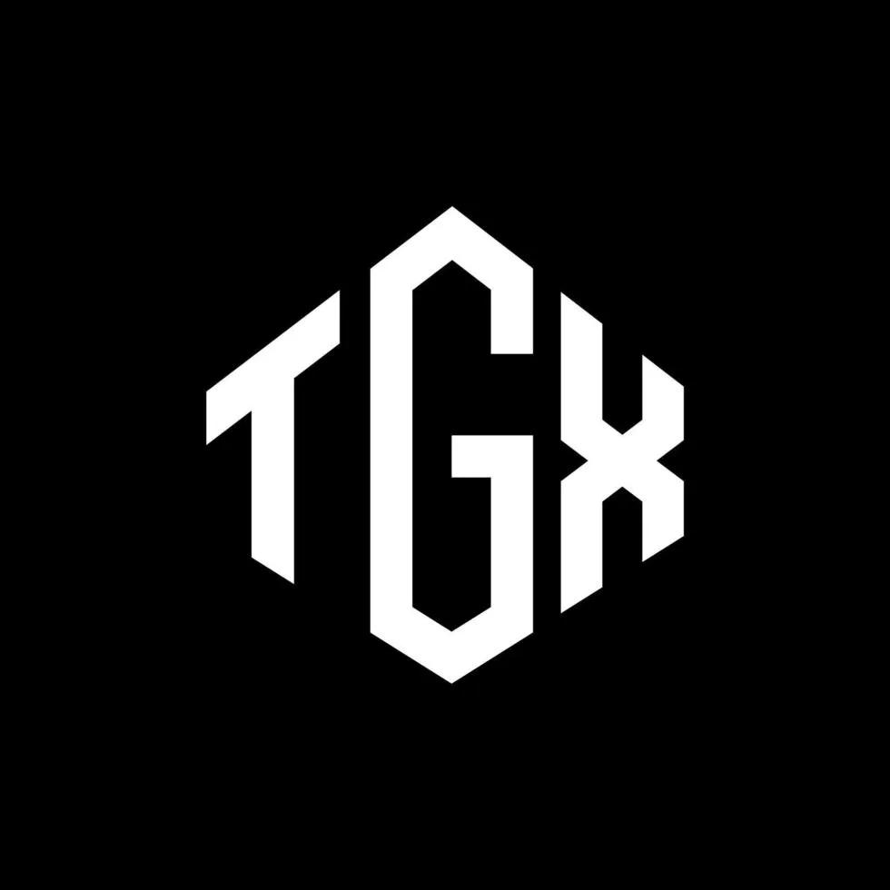

# TGXGang Website

<div align="center">
  
  <p><i>Descubre el potencial del exploiting con TGX</i></p>
</div>

## 📋 Descripción del Proyecto

TGXGang Website es el sitio web oficial para el software TGX, un exploiter para Roblox gratuito y fácil de usar. Este proyecto está desarrollado con Next.js y utiliza Fluent UI y Tailwind CSS para ofrecer una interfaz moderna y atractiva.

## 🌟 Características Principales

- **Diseño Moderno y Responsivo**: Interfaz de usuario atractiva con animaciones y efectos visuales.
- **Integración con Fluent UI**: Componentes elegantes y consistentes.
- **Secciones Informativas**: Hero, características del producto y showcases en video.
- **Optimización SEO**: Estructura optimizada para motores de búsqueda.

## 🚀 Tecnologías Utilizadas

- [Next.js 15](https://nextjs.org) - Framework React con App Router
- [React 19](https://react.dev) - Biblioteca de interfaces de usuario
- [Tailwind CSS 4](https://tailwindcss.com) - Framework CSS utility-first
- [Fluent UI](https://react.fluentui.dev) - Sistema de diseño de Microsoft
- [TypeScript](https://www.typescriptlang.org) - Superset tipado de JavaScript

## 🛠️ Estructura del Proyecto

```
src/
  app/                    # Directorio principal de la aplicación Next.js
    page.tsx              # Página principal
    layout.tsx            # Layout principal de la aplicación
    globals.css           # Estilos globales
    components/           # Componentes de la aplicación
      general/            # Componentes generales (header, footer)
      pages/              # Componentes específicos de páginas
        landing/          # Componentes de la página principal
          hero.tsx        # Sección hero con imagen y CTA
          Features.tsx    # Sección de características principales
          showcase.tsx    # Sección de videos demostrativos
public/                   # Archivos estáticos (imágenes, favicon)
```

## ⚙️ Instalación y Uso

1. Clona este repositorio:
```bash
git clone https://github.com/tgxgang/tgxgang-website.git
cd tgxgang-website
```

2. Instala las dependencias:
```bash
npm install
# o
pnpm install
# o
yarn install
# o
bun install
```

3. Inicia el servidor de desarrollo:
```bash
npm run dev
# o
pnpm dev
# o
yarn dev
# o
bun dev
```

4. Abre [http://localhost:3000](http://localhost:3000) en tu navegador para ver el resultado.

## 🔍 Secciones del Sitio

### 1. Hero Section
Sección principal con una imagen interactiva del software TGX, un título llamativo y botones de llamada a la acción para descargar el software o acceder a las preguntas frecuentes.

### 2. Features Section
Muestra las principales ventajas de TGX:
- 100% Gratis - Disfruta de scripting premium sin costo
- Instalación Fácil - Proceso de instalación sencillo
- Actualizaciones Frecuentes - Mantenimiento constante para asegurar funcionalidad

### 3. Showcase Section
Colección de videos demostrativos que muestran TGX en acción, con reproducciones de YouTube embebidas.

## 📦 Despliegue

El sitio está optimizado para ser desplegado en Vercel, pero puede ser desplegado en cualquier plataforma que soporte Next.js.

```bash
npm run build
npm run start
```

## 🤝 Contribución

Las contribuciones son bienvenidas. Para cambios importantes, por favor abre primero un issue para discutir lo que te gustaría cambiar.

## 📜 Licencia

Este proyecto está bajo licencia privada y es propiedad de TGXGang.
